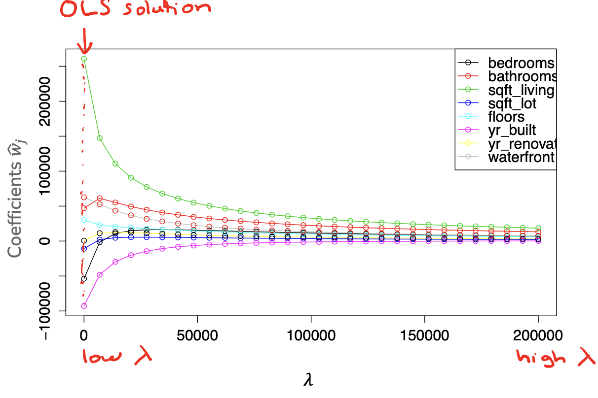
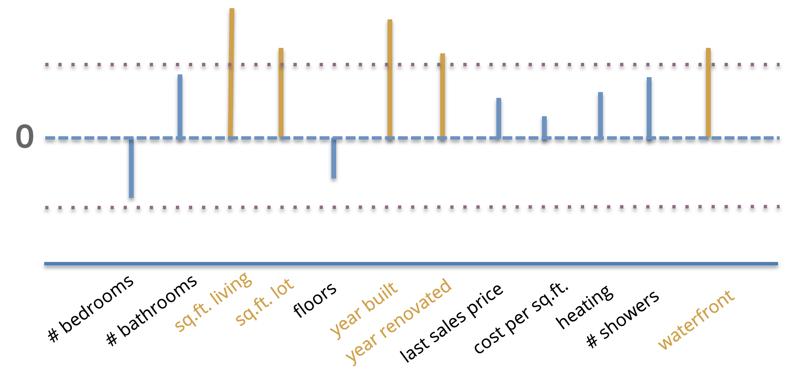
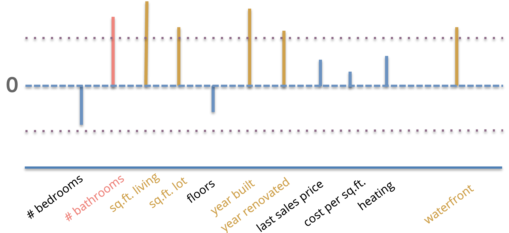

---
jupytext:
  formats: md:myst
  text_representation:
    extension: .md
    format_name: myst
kernelspec:
  display_name: Python 3
  language: python
  name: python3
myst:
  substitutions:
    ref_dna: 1
    ref_all_subsets_strs: 2
    ref_bathrooms: 3
    ref_coefficients_demo: 4
    ref_curse: 5
---

```{code-cell} ipython3
:tags: [remove-input]

# If you are reading this notebook on a Binder, make sure to right-click the file name in
# the left-side file viewer and select `Open With > Notebook` to view this as a notebook
```

# <i class="fas fa-book fa-fw"></i> Feature Selection and LASSO Regularization


In the last chapter on {doc}`../ridge/index` we discussed one technique to prevent our models from overfitting by using the concept of *regularization* to modify the quality metric used when learning our model parameters to penalize predictors with large coefficients. We augmented our original training quality metric that only cared about the training error $L(w)$ (in our case $MSE(w)$) by adding in a regularizer $R(w)$ to measure the magnitude of our models coefficients. The $\lambda$ term was a hyperparameter to control for how much we want to penalize high coefficients.

$$\hat{w} = \argmin{w}L(w) + \lambda R(w)$$

We also briefly discussed how there are many ways to define this regularizer $R(w)$. In the last chapter on {doc}`../ridge/index` we defined $R(w) = \lVert w \rVert_2^2 = \sum_{j=1}^D w_j^2$ which yields the Ridge Regression model. We also described using the regularizer $R(w) = \lVert w \rVert_1 = \sum_{j=1}^D \lvert w \rvert$. In this chapter we will discuss the importance of **feature selection** and how we can use the LASSO to help us accomplish that goal.

## Feature Selection

The process of **feature selection** is to narrow down from our list of possible features some subset of them that are the most "meaningful" or the most "effective" at predicting our labels. There are a few reasons why we might care to select just a few features to work with:

```{margin}
{{ref_dna}}\. Consider a simple approach to try learning on DNA sequences (strings of nucleotides A, C, T, G). You could imagine if you use one feature per section of DNA, we would have something like a $\hat{w}$ with approximately 3.2 billion coefficients that need to be learned ([source](https://nigms.nih.gov/education/Inside-Life-Science/Pages/Genetics-by-the-Numbers.aspx#:~:text=6&text=That's%20how%20many%20feet%20long,round%20trips%20to%20the%20Moon.))!
```

* *Model Complexity*: Models with more features tend to be more complex and are more likely to overfit. By reducing the numbers of features to a smaller subset that are the most meaningful, we hopefully can avoid overfitting.
* *Interpretability*: while a bit more nebulous in nature, we have a strong intuition that simpler models are easier for ML practitioners and users to understand. The idea is that if a model is simpler, it requires less cognitive load for a human to understand what the model is doing or why it makes the decisions it does.
* *Computational Efficiency*: In many settings, we can have feature spaces that are extremely large<sup>{{ref_dna}}</sup>. If there are many features, there will be many coefficients we have to learn. This will both cause a slow down in training time since we have to update and compute information for more parameters, but also when it comes to making predictions for new values. If we have to evaluate $\hat{y} = \hat{w}^Th(x)$, this requires doing an element-wise product and then summing up terms for every feature!

However, many of these problems are solved if we demand that the learned coefficients $\hat{w}$ are **sparse**, or many of the coefficients are 0. That means we only have to consider the relatively few coefficients that are non-zero. How many is enough is yet another modeling decision we will set as a hyperparameter.

$$\hat{y} = \sum_{\hat{w}_j \neq 0}\hat{w}_j h_j(x)$$

This notion is also helpful if you consider a real-world setting such as our task of predicting the price of houses. There are potentially many features that we could use, but maybe only a few of them are the "most important bits" of information that have the highest impact on house price. Additionally, many of the features might be strongly correlated so including them all might be redundant.

Sparsity in our models is also a useful tool for scientific discovery. Imagine a neurologist investigating how brain activity relates to happiness. The inputs $x$ are descriptions of an image scan of the brain (many features for all pixels in the image) and the output is some number from 0 to 10 describing how happy the person was at the time of that brain scan. If we train a model to predict happiness from brain state, and additionally require that model is *sparse*, it might help us find the most important areas of the brain for influencing happiness. This can then inspire future research into brain activity.

```{image} ./brain.png
:align: center
:alt: An image of a brain activity lighting up (inputs x) and mapping on a scale from 0 to 10
```

## All Subsets

Our initial approach to selecting the subset of features will, in some sense, be the theoretically "best" way to find the best subset of features, but we will see might not actually work in practice.

If we are interested in trying to find the subset of features that are the most important, the simplest approach we could consider is just try out *every* subset of features to find which one is optimal. As a small example, if you have features A and B, you could try out models that use
* None of the features (i.e., the empty set of features)
* Just feature A
* Just feature B
* Both feature A and B

With more features to choose from, you can do a similar enumeration of all possible subsets. From our discussion of model complexity in {doc}`../assessing_performance/index`, we can already start to make some assessments of how using more or fewer features in our subset of selected feature affects our model performance:

* If we select fewer features, our model will tend to be simpler (higher bias, lower variance). If it is too simple, we will expect both high training error and high true error.
* If we select more features, our model will tend to be more complex (lower bias, higher variance). If the model is too complex, we will expect low training error and high true error.

So, if we want to choose the right subset of feature of the right size, we will have to use a procedure like we have discussed multiple times previously: Try all of the options and compare them by some sort of validation error (either using a validation set or cross validation).

Consider our housing dataset, and only considering the features:
* \# bathrooms
* \# bedrooms
* sq.ft. living room
* sq.ft. lot
* \# floors
* year built
* year renovated
* waterfront

```{margin}
TODO add animation
```

The following graph shows running this experiment on all subsets of these features. The x-axis shows the number of features considered at a time and the y-axis shows the validation $MSE$ on some held out dataset. Each dot corresponds to one model trained by some subset of these features. For example one subset of these features of size 3 is `[\# bathrooms, sq. ft. living, year built]`. Even for a fixed size for the subset of features (e.g., 3), you will see performance all over the place from different subsets of that size simply because some subsets of feature are more informative than others. For each size, the optimal subset (based on minimum validation error) is highlighted in pink. So using our selection process, we would probably choose the features associated to the pink dot with 6 features chosen.

```{image} ./all_subsets.png
:align: center
:alt: A graph showing the errors of models trained on various subsets of the features. Described in last paragraph.
```

One important note is that the optimal set of $k$ features may or may not have overlap with the optimal set of $k+1$ or $k-1$ features. In other words, the sets of optimal features are not "nested". For example, it's possible for the optimal subset of features, when limited to one feature, is just `[sq.ft. lot]`. But when we allow it to include 2 features, maybe it's the case that `[\# bathrooms, \# bedrooms]` are more information *jointly* but not separately. Because of this, we are really limited to trying all possible subsets if we want to find the globally optimal subset of features.

### Efficiency of All Subsets

One question we might ask is: How efficient is this algorithm? If I have $D$ features to choose from, how much time might it take to try out all of these possibilities? We'll see that this algorithm is actually not that practical because its runtime is primarily based on the number of subsets there are of $D$ features, and it turns out that number can be high for even a moderate number of features.

To count the number of possible subsets, we could try writing out all of the possible models (for consistency, we will use the notation $w_i$ to match the index $i$ for our feature vector $h_i(x)$.

| Model                                                          |
| :------------------------------------------------------------- |
| $\hat{y}_i = w_0$                                              |
| $\hat{y}_i = w_0 + w_1h_1(x)$                                  |
| $\hat{y}_i = w_0 + w_2h_2(x)$                                  |
| ...                                                            |
| $\hat{y}_i = w_0 + w_1h_1(x) + w_2h_2(x)$                      |
| ...                                                            |
| $\hat{y}_i = w_0 + w_1h_1(x) + w_2h_2(x) + ... + w_Dh_D(x)$    |


```{margin}
{{ref_all_subsets_strs}}\. We are assuming here that you always include the intercept $w_0$. You could extend all of this discussion to include/exclude the intercept as well if you choose.
```

Even with just our $D = 8$ features, there are quite a lot of them to list out. But we can actually come up with a trick to count them without listing them out! We make the observation that every one of these models either contain some feature $h_i(x)$ or they do not. In other words, we can write out a string of 0s and 1s to name each of these models, where a 1 at index $i$ indicates feature $i$ is in the model, and a 0 indicates it's not<sup>{{ref_all_subsets_strs}}</sup>. So we could write these model strings down as following

| Model                                                          | String              |
| :------------------------------------------------------------- | :------------------ |
| $\hat{y}_i = w_0$                                              | `[0 0 0 ... 0 0 0]` |
| $\hat{y}_i = w_0 + w_1h_1(x)$                                  | `[1 0 0 ... 0 0 0]` |
| $\hat{y}_i = w_0 + w_2h_2(x)$                                  | `[0 1 0 ... 0 0 0]` |
| ...                                                            | ...                 |
| $\hat{y}_i = w_0 + w_1h_1(x) + w_2h_2(x)$                      | `[1 1 0 ... 0 0 0]` |
| ...                                                            | ...                 |
| $\hat{y}_i = w_0 + w_1h_1(x) + w_2h_2(x) + ... + w_Dh_D(x)$    | `[1 1 1 ... 1 1 1]` |

You may or may not have seen how to count all binary strings (strings of 1s and 0s) of length $D$ before. The trick is to notice that at each index, there are two choices (0 or 1). So the number of strings possible is $2 \cdot 2 \cdot 2 \cdot ... \cdot 2$ ($D$ times), also written as $2^D$. Computer scientists use the notation $\mathcal{O}(2^D)$ to describe the runtime of this algorithm primarily depends on the number of subsets here $2^D$.

If you haven't seen algorithms that scale like this before, you might be thinking that it can't be *that* bad. Let's work through a concrete example to see how this model scales. Suppose it takes our computer 8 minutes to calculate all of the validation errors for all subsets of 8 features (that works out to about 20 milliseconds per subset of features). Take a guess how long you think it would take to train the following all subset models before expanding to see their answers. Really, make a guess before clicking the drop down to see how close you were!

```{dropdown} What if we tried all subsets of 16 features?
This would take about $21$ **_minutes_** (about 256 times as long as 8 features)
```

```{dropdown} What if we tried all subsets of 32 features?
This would take about $3$ **_years_** (about 17 million times as long as 8 features)
```

```{dropdown} What if we tried all subsets of 100 features?
This would take about $7.5 \cdot 10^{20}$ **_years_** (a lot longer than our 8 features model). For reference, this is approximately 50,000,000,000 times the age of our universe 😱
```

To be very clear, 100 features is not what companies are all excited about when they are talking about "Big Data". The datasets used in many real-world applications are orders of magnitudes larger than these relatively small examples. So clearly, this algorithm while it will find the best subset, it won't find it in a practical timeline!

So if this algorithm is not practical, what can we do? At a high level, we will have to settle for an approximation. We will come up with some algorithm that will run in our lifetimes, but it won't guarantee to find the best possible subset.

At a high level, the two approximations we will explore for the rest of this chapter are:

1. Greedy algorithms
2. Regularization

## Greedy Algorithms for Feature Selection

A **greedy algorithm** is a flavor of algorithms for approximating intractable solutions like the best subset of features. So instead of finding the best option by trying every possible option, we will build up a solution by *greedily* choosing the best option at the time. Many of us are familiar with greedy algorithms. Every time to you go to a new grocery store, you often just start shopping down the aisles right in front of you rather than getting a floor plan of the whole store to plan some globally optimal route. It's possible your greedy route might not be optimal, but it's hopefully not that much worse and maybe saves you time that it would have taken you to find the map and compute the "optimal" path.

There are lots of examples of algorithms that try to approximate solutions using a greedy approach. For feature selection, they generally fall into one of three possible types, although others exist as well!

* **Forward Stepwise** algorithms generally start with an empty set of important features, and iteratively add features to this set as performance improves.
* **Backward Stepwise** algorithms generally start with the full set of features as important features, and iteratively remove features that are the least important.
* **Combining these two options** algorithms generally have some heuristic of combining these two approaches of adding/removing features from this selected set.

Importantly, regardless of which type of algorithm you use, the answer it will find is still an *approximation*. There are no guarantees that it is going to find the optimal subset of features; as we discussed doing so will take to long.

We will focus on the Forward Stepwise algorithm as a concrete example, and leave it as an exercise to explore how it would be adapted for a backwards or combination version.

### Example: Forward Stepwise Algorithm

The high level idea of the Forward Stepwise algorithm is to iteratively add features to our selected set as they improve performance. We assume you pre-select some desired number of features $k$ as the maximally allowed size of the set of important features; although we have in this algorithm to select a smaller subset if validation performance starts to decrease.

```{prf:algorithm} Forward Stepwise Algorithm
:label: forward-stepwise

**Inputs**
* A training dataset $X_{train} \in \mathbb{R}^{n\times D}$ with features $h_1(x), h_2(x), ..., h_D(x)$
* A validation error function $MSE_{val}(\hat{f})$
* A maximum number of selected features $k$

**Output** A set of selected features $S \subseteq \{h_1(x), h_2(x), ..., h_D(x)\}$ with $\lvert S \rvert \leq k$

1. $\texttt{min_val} \gets \infty$
2. $S_0\ \gets \emptyset$
3. for $i \gets [1, k]$:
    1. Find feature $h_j(x)$ not in $S_{i-1}$, that when combined with the features in $S_{i-1}$ minimize the validation loss $MSE_{val}(\hat{f})$ the most. Call this model $\hat{f}_i$ (trained on $h_j(x)$ and $S_{i-1}$)
    2. if $MSE_{val}(\hat{f}_i) > \texttt{min_val}$
        1. Break and return $S_{i-1}$
    3. $S_i \gets S_{i-1} \cup \{h_j(x)\}$
    4. $\texttt{min_val} \gets MSE_{val}(\hat{f}_i)$
4. Return $S_i$
```

While the details are a bit complicated, this is really just saying "keep adding features to our set of important features until we reach $k$ features or the validation error increases".

```{admonition} Practice
:class: important

Suppose we were working with a small set of 4 features on our house price prediction task. Below we show two tables, the first shows the validation errors when considering just a single feature and the second shows the validation errors considering two features. **Following this Forward Stepwise Algorithm, which subset of two features would be selected by this algorithm?**

Table 1: Validation Errors for Subsets of Size 1

| Feature    | Validation Loss |
| :--------- | --------------: |
| # bath     | 201             |
| # bed      | 300             |
| sq ft      | 157             |
| year built | 224             |

Table 2: Validation Errors for Subsets of Size 2

| Features (unordered) | Validation Loss |
| :------------------- | --------------: |
| # bath, # bed        | 120             |
| # bath, sq ft        | 130             |
| # bath, year built   | 190             |
| # bed, sq ft         | 137             |
| # bed, year built    | 209             |
| sq ft, year built    | 145             |
```

```{code-cell} ipython3
:tags: ["remove-input"]

questions = [
    {
        "question": r"""Which set of features would be chosen following this Forward Stepwise model?""",
        "type": "multiple_choice",
        "answers": [
            {
                "answer": "# bath, # bed",
                "correct": False,
                "feedback": "Not quite! While this is the best subset with two features, is this the one that our forward algorithm would end up picking?"
            },
            {
                "answer": "# bath, sq ft",
                "correct": True,
                "feedback": "Correct! The first iteration would choose sq ft because it was the single feature with lowest validation error. Then on our second iteration, we will only consider adding one of the other unchosen features to be included with sq ft. The set of features that includes sq ft that minimizes validation error is # bath and sq ft. Note that this algorithm did not find the globally optimal subset of features of # bed and # bath"
            },
            {
                "answer": "# bath, year built",
                "correct": False,
                "feedback": "Not quite!"
            },
            {
                "answer": "# bed, sq ft",
                "correct": False,
                "feedback": "Not quite!"
            },
            {
                "answer": "# bed, year built",
                "correct": False,
                "feedback": "Not quite!"
            },
            {
                "answer": "sq ft, year built",
                "correct": False,
                "feedback": "Not quite!"
            },

        ]
    },
]

from jupyterquiz import display_quiz
display_quiz(questions, shuffle_answers=False)
```

## Regularization

Another approach to achieve feature selection is to apply a regularization approach to hopefully shrink the coefficients for features that are somehow less meaningful or less important. Recall from our last chapter on {doc}`../ridge/index`, we added a regularizer term $R(w)$ to our quality metric to penalize predictors with large coefficient magnitude.

$$\hat{w} = \argmin{w}L(w) + \lambda R(w)$$

Let's discuss how we can try to achieve feature selection using our idea of regularization to achieve feature selection. We briefly discussed how there may be different choices for $R(w)$ to measure the magnitude of coefficients differently, but in the last chapter we focused in detail on the regularizer $R(w) = \norm{w}_2^2$. Importantly, we explored that as we increase the regularizer penalty $\lambda$, the coefficients shrink more and more.



The main idea of our approach is to train some Ridge model (with some choice of $\lambda$) on our data, and then investigate the learned coefficients. Our intuition is that larger coefficients indicate something like the feature is more impactful on the output, and in turn, small coefficients mean that feature isn't as important.

We can visualize these coefficient magnitudes as a bar chart showing coefficients (signed) with higher magnitudes as longer bars. So if we would like to do feature selection with this approach, we could simply choose some number $\delta$ and say that any coefficients $\hat{w}_j \lt \delta$ are considered "unimportant". This is shown in the image below where the value of $\delta$ is shown as the horizontal dotted line, and important features are ones whose magnitude is greater than $\delta$ highlighted (shown in gold). Any of the features with coefficients smaller than $\delta$ will be considered unimportant and not selected in our feature selection process.



One discussion we would need to have if we were going to pursue this approach is to decide how to choose $\lambda$ (the penalty term) and how to choose $\delta$ (the cutoff to exclude a feature). However, it turns out that while this idea of Ridge regularization for feature selection seems like a good idea by intuition, it turns out to not work well in practice. This happens for two main reasons:

First, choosing this cutoff $\delta$ isn't the most intuitive. As a hyperparameter we choose *after* training the model, it's hard to come up with approaches to tune this hyperparameter in our training procedure. Also the scale of this hyperparameter $\delta$ depends a lot on the scales of the inputs/outputs of the data.

Secondly, and more importantly, the results of this approach are can become questionable when you have features in your dataset that are correlated. Consider the example we showed above for selecting the features with larger coefficients. If you look at the features we selected, *none of them* correspond to a notion of bathrooms in a house. IF you were writing a research paper, you might then come to the conclusion that bathrooms have no (or little) affect on house price since you didn't find them to be important via your feature selection algorithm.

```{margin}
{{ref_bathrooms}}\. Would you be equally happy in / willing to pay the same amount for a house with 0 bathrooms vs a house with 2 bathrooms?
```
However, the problem here is not that bathrooms are unimportant<sup>{{ref_bathrooms}}</sup>, but the fact that they are represented by multiple features in the dataset. In this example, we had a feature `# bathrooms` and `# showers` represented in this dataset. For simplicity, let's assume there is a 1:1 relationship from bathrooms and showers (i.e., every bathroom has exactly 1 shower). If this is the case, the model has to "split up" the coefficients between the two features as every time one feature increases in value, the other increases in value as well. Because the model divides the coefficient magnitude between the two features, the seem unimportant when in reality, it would have been important if we just removed one of those features.




This is cause to bring up a very important point.

```{admonition} Feature Selection: Context Matters
:class: important

Whenever you do an analysis to make a claim about which features are or are not important to some system, it's essential that you remember your results are based on the context of the data you chose to include in your analysis. By that, we mean exactly the phenomenon we saw in this flaw of Ridge Regularization for feature selection. By including `# bathrooms` and `# showers`, we made the discovery that bathrooms are unimportant. By doing the same analysis with `# showers` removed, we have no identified `# bathrooms` are important. The results we found depend on the data we put it.

While this sounds somewhat trivial, it's often forgotten by ML practitioners and scientists. You always need to be aware of the context you are creating by the data you include and the models you choose to use. The results you find may be useful, but they are not *objective*; your results are entirely dependent on your *subjective* (but hopefully well-reasoned) choices for which data to include and which models to use.
```

So with these flaws, Ridge regularization is rarely used for feature selection. But fear not! It is still a useful idea if we change the details of how we regularize.

## LASSO Regularization for Feature Selection

When we first introduced the concept of regularization in {doc}`../ridge/index`, we discussed a few options we could use for the regularizer $R(w)$. While we discussed the use of the L2 Norm $\norm{w}_2^2$ as a regularizer in detail, that is by no means the only choice. In fact, we discussed another reasonable regularizer would be the sum of absolute values of coefficients, also called the L1 Norm $R(w) = \norm{w}_1$.

By using the same regularization setup, but with the L1 norm as the regularizer, we get a model called **LASSO Regression** or **Regression with LASSO Regularization**.

$$\hat{w}_{LASSO} = \argmin{w} L(w) + \lambda\norm{w}_1$$

The good news, is that while this is technically a new model we a lot of our intuition from Ridge Regression! In particular,

* LASSO tends to shrink the coefficients to prevent overfitting, just like Ridge.
* As you increase the penalty term $\lambda$, the coefficients shrink more. If you make $\lambda$ very small, then there is not much penalty and the model is more likely to be like our OLS solution.
    * In the terminology of bias and variance: A small $\lambda$ corresponds to a model with lower bias and higher variance while a large $\lambda$ corresponds to a model with higher bias and lower variance.

Despite having a lot of similarities, the primary difference between Ridge and LASSO is the exact behavior of the coefficients as they shrink.

If we look back to the coefficient path for Ridge Regression, we see that the coefficients shrink, but generally don't become 0 until the limit of $\lambda = \infty$. With Ridge, the coefficients just get smaller and smaller in magnitude.


```{margin}
{{ref_coefficients_demo}}\. See [Google's Demo](https://developers.google.com/machine-learning/crash-course/regularization-for-sparsity/l1-regularization) for another visualization of the difference between Ridge and LASSO solutions.
```

But if we look at the coefficient path with LASSO, we see a much different story. Importantly, everything else to make this graph is the same as the Ridge coefficient path, except we are using the L1 norm as the regularizer in this LASSO model. Notice how the coefficients tend to go down *exactly* to 0 instead of just getting infinitesimally small. Again, we see the trend of coefficients shrinking with larger $\lambda$, but importantly the coefficients become 0 more quickly than in Ridge<sup>{{ref_coefficients_demo}}</sup>.


In other words, in LASSO Regression, it favors **sparse coefficients** (coefficients with more zeros)! This now makes it a great tool for feature selection since it gives us sparsity out of the box!

Even in the case with correlated features (such as `# bathrooms` and `# showers`), LASSO tends to handle this situation without a problem. Because it favors sparse solutions, it has no problem making one of those coefficients 0!

In some sense, that's all we technically have to say about LASSO if you take our claim at face-value. It serves to highlight this claim in an special box to highlight that this is the important property we care for your to know well.

```{admonition} LASSO Regression
:class: tip

LASSO is a regularization technique to shrink coefficients, much like Ridge Regression. While they are similar at a high-level, LASSO has the special property that it tends to find *sparse coefficients* solutions while Ridge does not. The higher $\lambda$ is, the more zero coefficients will be found.

This doesn't mean it will always find 0 coefficients. But it is likely in practice to make more coefficients exactly 0 as you increase $\lambda$.
```

In the following sub-sections, we will try to argue the reason why simply changing the regularizer changes the result so much, and why LASSO tends to lead to sparsity. These will not be formal proofs, but instead will be heuristic arguments to try to convey the important ideas. Understanding the intuition for *why* LASSO has this property is less important than knowing this property exists, so it is okay to skip the next two subsections.

### Why Sparsity? Analytical View

One way to see why LASSO favors sparse solutions is to compare the measurements of magnitude $R(w)$ analytically. In the plot below, we plot the cost functions $R(w)$ for a single-coefficient $w_1$. Note that in the case of a single coefficient $w_1$, the L1 Norm $\norm{w}_1 = \abs{w}$ and the L2 norm $\norm{w}_2^2 = w_i^2$.

<!-- TODO Make this image nicer -->
```{image} ./compare_costs.png
:alt: A graph showing the cost between the L1 norm (absolute value) and L2 norm (parabola)
:width: 100%
:align: center
```

Now, consider what happens as $w_1$ gets smaller in magnitude. In particular, consider the case when $-1 \leq w_1 \leq 1$. At this point the value of the L2 norm falls below the L1 norm. Importantly, because the L2 norm is a parabola, the slope gets smaller and smaller as you get towards $w_1 = 0$. The result of this is there are *diminishing returns* in the L2 norm from decreasing the $w_1$ as its magnitude drops below 1. For a concrete example, compare the change in cost $R(w)$ between the points $w_1 = 0.25$ and $w_1 = 0.1$.

* With the L1 norm $\abs{0.25} - \abs{0.1} = 0.15$. So by decreasing our coefficient $w_1$ by $0.15$, we reduced the cost of $R(w)$ by $0.15$.
* With the L2 norm $0.25^2 - 0.1^2 = 0.0525$. So by decreasing our coefficient $w_1$ by $0.15$, we only reduced the cost of $R(w)$ by $0.0525$.

So in practice, regularizing with the L2 norm has *no incentive* to make coefficients actually zero; there are fewer and fewer reductions in the cost $R(w)$ as the coefficients approach zero. On the other hand, the L1 norm has no such diminishing returns so it is entirely feasible for it to set a coefficient to exactly 0.

### Why Sparsity? Geometric View

Another way to view the sparsity of LASSO is thinking of the geometry of the functions we are minimizing. The way we have been phrasing regularization is finding the coefficients $w$ that minimize

$$\hat{w} = \argmin{w} L(w) + \lambda R(w)$$

This is called an *unconstrained* optimization problem as there are no constraints on what $w$'s values need to be, just that it should minimize the combined costs. A *constrained* optimization problem is one with explicit requirements on which $w$s are acceptable. It turns out there is a nice bit of theory showing you can convert from constrained/unconstrained optimization problems. So another way we could have formulated our regularization problem is as follows.

$$\hat{w} = \argmin{w; R(w) \leq \beta} L(w)$$

This is a similar problem, but says to minimize $L(w)$ such that $R(w)$ doesn't exceed some budget $\beta$. We won't go into the details of how $\lambda$ and $\beta$ relate, but there is theory that shows you can convert between the two problem types. Another way this is phrased is our original approach was a "soft" constraint since it just made the objective function worse for some inputs, while this new version is a "hard" constraint that the coefficients can't exceed some value.

Geometrically we can see this as a constraint on which $w$'s are acceptable solutions. So instead of considering all possible $w$'s, we only consider the subset of them that satisfy our budget. Visually you can compare these feasible regions of the L1 and L2 norms for some budget $\beta$ in the image below. These feasible regions are known as the L1-ball and L2-ball respectively. A ball is the set of points with distance $R(w) \leq \beta$. You can see the L1 ball looks like a diamond while the L2 ball looks like a circle.

```{image} ./norms.png
:alt: A graphical representation of the L1 ball (diamond) and L2 ball (circle) on a graph of MSE(w)
:width: 100%
:align: center
```

Now from our discussion of optimization from {doc}`../linear_regression/index` talked about minimizing our loss function $MSE(w)$ over all possible $w$'s, but now we are just considering ones in these feasible regions $\{w : R(w) \leq \beta\}$. In English, we are finding the point in these regions that minimize the loss $MSE(w)$. Now it tends to be the case that with the L1 norm, it looks like this diamond and is "pointier"; the corners of this diamond correspond to sparse solutions! And it turns out that these corners tend to reach points of the objective $MSE(w)$ that are nearer to it's optimal point. Note, that is just a statement of a heuristic. It is not saying that it will always be in a corner, it's just often the case it is in a corner. That's why we say LASSO *tends to* find sparse solutions, not that it always finds them.

<!-- TODO cite chapter -->
```{margin}
This is referred to as the **curse of dimensionality** which we will discuss later.
```
This also becomes more likely as we increase the dimensionality of our feature space. It turns out that in higher dimensions, our intuitions of geometry don't really quite apply<sup>{{ref_curse}}</sup>. But in these higher dimensions, this pointy behavior of the L1 ball is even more extreme, and it is even more likely for one of these corners to be nearest the minimum of the objective function.

Again, all of this is a bit hand-wavy, but we are just trying to impart some intuition on the reasons we see this in practice. So we hope these somewhat convince you, but understanding them in detail are not the most important for our use case.

## Practicalities with LASSO

In this last section, let's discuss some important practicalities with using LASSO.

### Choosing $\lambda$

We have ignored so far how to exactly choose the tuning parameter $\lambda$. As we increase $\lambda$, we decrease the magnitude of the coefficients, which will increase the sparsity of the solution (more zero coefficients founds). How do we know what the right $\lambda$ is? Well it depends on what you want to use the model for!

If, say, you are interested in finding the 10 most important features for some prediction task, then you'll likely want to choose a $\lambda$ large enough to make all but 10 coefficients 0.

Most often though, people care about finding a model that tends to do well predictively on future data. In that case, you would use the exact same hyperparameter turning algorithms we've discussed before such as evaluating different choices of $\lambda$ on a validation set or using cross-validation.

### LASSO Only for Feature Selection

One of the benefits of LASSO is this notion of feature selection we get from the sparsity of its solutions. Empirically, we often find that the *predictive performance* (e.g., validation MSE) of LASSO is worse than other models such as Ridge Regression. That doesn't mean people don't use it in practice, they do! It's just often times other models will outperform it.

Because of that, one major use case of LASSO is just for feature selection, and then training some other model on the features LASSO chose as most important. You often will need to use your domain-specific expertise to ensure the selected features actually make sense to use as inputs for another model. But after selecting the most important features, many times ML practitioners will now start over with a new model only trained on those features.

A common setup for this is called the **De-biased LASSO** which at a high-level is a two-step process.

1. Take the original dataset and run it through LASSO (with some $\lambda$ chosen to balance the number of selected features). Mark which features have non-zero coefficients.
2. Remove all non-selected features from the original dataset and then re-run an Ordinary Least Squares (i.e., plain regression without regularization) with only those features.

Since we are now using fewer features, we are a little less concerned about an un-regularized model overfitting. This has a sort of "best of both worlds" benefit, where we get feature selection from LASSO and predictive performance from OLS! We outline a more detailed procedure for this De-biased LASSO below.


```{prf:algorithm} De-Biased LASSO Training Procedure
:label: de-biased-lasso

1. Split the dataset into a training, validation, and test sets
2. Normalize the features. Normalize **using the statistics from the training set** to scale the values from the training set, validation set, and test set
3. Use the validation set to find the value of $\lambda$ that results in a LASSO model with the lowest validation error
4. Select the features of that model that have non-zero parameters
5. Train a Linear Regression model with those features
6. Evaluate that model on the test set to get an estimate of future performance
```

### Issues with LASSO

Like any model, LASSO makes its own assumptions about how the world works, and that comes with its own set of limitations.

1. As we discussed, LASSO tends to have lower predictive performance compared to other models such as Ridge Regression.
2. Even though LASSO can handle correlated features (# bathrooms, # showers), it tends to pick between those features arbitrarily. That means you have to be careful with how you interpret your results. If LASSO says `# showers` is important it could really just mean some abstract measure of how many bathrooms you have is useful, and you might not improve the value of your house by building 100 more showers.

In practice, these issues can be solved with a little bit of extra work that usually depends on the domain you are working in. One common approach to at least the first issue is to use a combined model type called **Elastic Net** which tries to combine the benefits of Ridge and LASSO in one model. The idea is to use a combination of both measures of coefficient magnitude as penalities in the objective function.

$$\hat{w}_{ElasticNet} = \argmin{w} MSE(w) + \lambda_1 \norm{w}_1 + \lambda_2 \norm{w}_2^2$$

## Grain of Salt: Feature Selection

As we highlighted before, be very careful with how you interpret the results of an algorithm used for feature selection/importance. Importantly, any feature selection procedure:

* Only considers the features included in the analysis
* Is sensitive to correlations between the features
* The results that you would publish of "this is the most important feature" depend on which algorithm you use!

At the end of the day, feature selection is just another modelling choice. You should always combine the results from the statistical insights these models give you with the domain-specific expertise for how to interpret the phenomena in the data we see.

## Recap: Compare Ridge and LASSO

As a short recap of everything we have discussed so far, we highlight some important bullet points for Ridge and LASSO specifically

**LASSO (L1 Regularization)**

* Tends to introduce sparsity in the learned coefficients.
* Helpful for feature selection, making the model hopefully more interpretable
* Tends to be more computationally efficient when predicting (due to sparsity)

**Ridge (L2 Regularization)**

* Makes weights smaller (but not 0)
* More sensitive to outliers (due to the squaring term)
* Usually has better predictive performance in practice

<!-- TODO Add questions -->